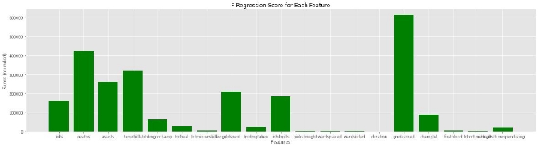
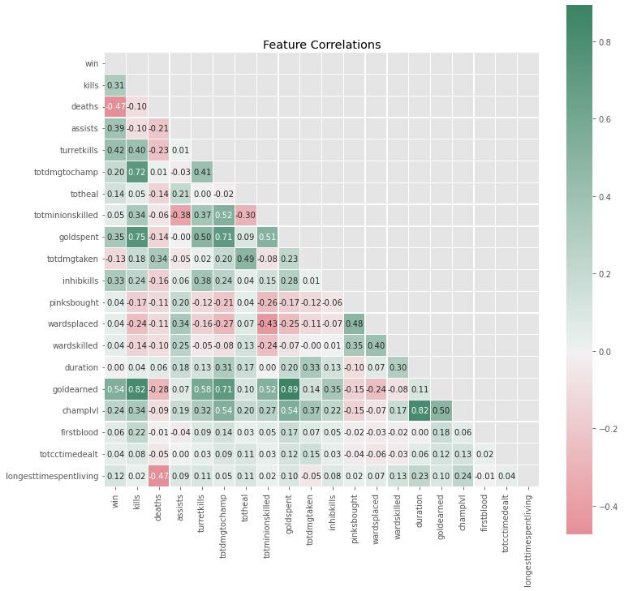
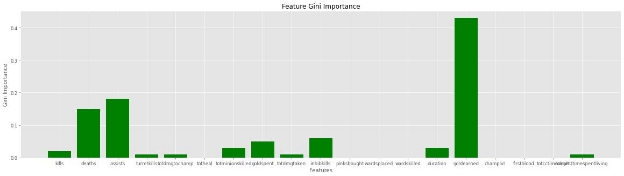
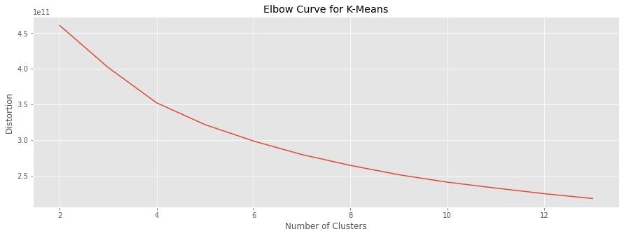
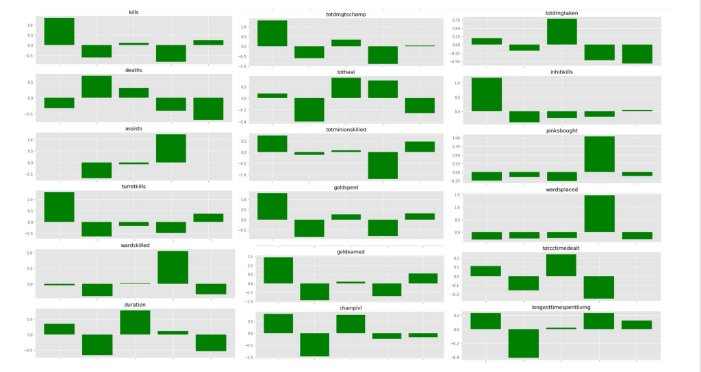
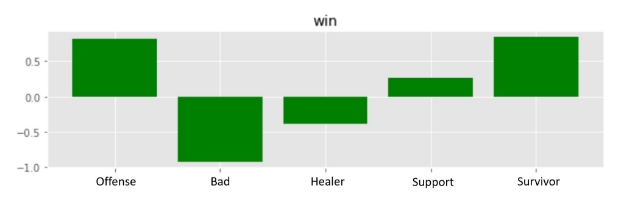

**Group 48**

*Benjamin Lathrop, Noah Bond, Jiacheng Shang, Zhenyu Wu, Garrett Norden*

**Background**

League of Legends is a free to play PC game in which two teams of five players work together to defeat their opponents and destroy the enemy team’s base. There are a wide variety of characters to choose from, as well as a variety of objectives in the game that can provide players with gold. Because of the wide array of variables in League of Legends, our group decided it would be the perfect place for a machine learning project.

**Problem Definition**

Our goal is to utilize Machine Learning to discover the most impactful contributing factors towards a victory in order to help form a prediction of what team will win a match. These factors can include the characters on each team, damage done per minute, gold collected, and more. There are many ways this model could be used. Teams wanting to experiment with new team compositions without wanting to hurt their rankings could see how changes in heroes could affect their predicted win rate. Players could also see the most important elements of a match - i.e., the features that drive the prediction the most. Many of the viewers of competitive matches could also use these predictions to make more informed betting decisions.

**Dataset**

The dataset was obtained from Kaggle, and contains data for 184,070 League of Legends ranked solo games. This is direct data from the League of Legends servers, and as such will be generally accurate across all skill and gameplay levels.The data is separated in different csv’s for match data, player data, and champion data, so we imported them and appended them into the same dataframe.

**Data Cleaning**

To prevent the data from being skewed by matches that ended in disconnects, forfeits, or general “game-throwing,” we dropped all games lasting less than 15 minutes. In addition, some matches had duplicate roles, so we dropped any matches that had duplicates. We also divided most features by the duration of a match, in order to display them as rates per minute to make them more compatible with each other.

In total, before cleaning there were 184,070 matches, and after cleaning that was reduced to 148,638. That’s around 19% total reduction. This means our dataset was still largely useful and would give us accurate information

**Feature Selection**

After those drops, the features needed to be addressed. There were around 50 columns in the “stats” csv to begin with, pertaining to stats concerned with the gameplay itself, such as “kills”, “deaths”, “gold earned”, and “physical damage dealt.” However, this is a very high amount, so before doing the actual feature reduction, we manually dropped many of the clearly non-important columns. After cleaning these columns, we still had around 20 left, which still is a relatively high amount, so we looked towards methods for feature reduction.

We mainly tested two different methods for reducing our features - SelectKBest, and PCA.

SelectKBest picks the top features based on a score function. We experimented with several different scoring functions, mainly f\_regression. F regression was chosen as a method to directly compare whether our model is actually improving in its fit by doing a comparison against the F value, where all the regression coefficients are equal to zero. This method will help to tell us when our changes in regression coefficient improves the model.

Contrasting with KBest feature selection, we also tried PCA dimensionality reduction on the dataset. The main reasoning for this was the overabundance of features in our dataset. Through PCA dimensionality reduction, we hope to isolate the most important features in order to create a better predictive model overall.

We used the f\_regression to get scores for every one of the features. Using their scores to rank them gives the following:

|Feature Name|f\_regression score|Explanation / Notes|
| - | - | - |
|Gold Earned|612876.07|If a game goes on long enough, players will reach their item cap and gold will stop mattering. Until then, a lead in gold earned is what gives a player their greatest advantage over an opponent|
|Deaths|423825.74|Time needed to return after dying goes up during the game. While dead, you can fall behind as your opponent collects gold, xp, and damages or kills turrets.|
|Turret Kills|318142.5|Turrets stand between teams and the enemy base and must be destroyed in order to win.|
|Assists|259543.0|Overall, used as a metric to see if teams are fighting together or alone. A team with many assists usually fights together rather than alone.|
|Gold Spent|210293.67|Gold is used to buy items that improve stats and can provide new abilities.|
|Inhibitor Kills|184150.42|At least one inhibitor being destroyed is required for a win.|
|Kills|160946.57|When a player gets a kill, they earn gold, experience, and most importantly an edge over their lane opponent. This can lead to snowballs in games if a player gets many kills in the opening minutes.|
|Champion Level|89209.08|Champions level up from experience and gain more powerful abilities with each level.|
|Total Damage To Champions|64660.83|For more defensive champions, the goal is usually to survive damage. For offensive, it is dealing damage.|
|Total Healing|27992.51|Not all champions can heal themselves or others, but all can buy healing potions and build lifesteal.|
|Total Damage Taken|23635.04|A higher amount of damage taken can correspond to more deaths.|
|Time Spent Living|20226.38|Living Players have the potential to actively participate towards their team’s success instead of being out of play.|
|First Blood|5524.02|Refers to the first kill of the game. This kill rewards more gold than a normal kill.|
|Total Minions Killed|3775.25|Killing minions is the most consistent way to earn gold. During early phases of the game, this will be the focus of many players, even over getting kills.|
|Wards Placed|2271.04|Wards provide vision at the location they are placed and are essential for high-level play.|
|Wards Killed|2258.64|Killing wards removes the vision of the enemy team around a certain area. Teams without vision in certain areas may be forced to abandon objectives or risk getting ambushed.|
|Pink Wards Bought|2111.36|Pink wards disable normal wards and cost gold each time they are used.|
|Total CC Time Dealt|2055.69|CC (Crowd Control) refers to things like being stunned, slowed, or put to sleep. Many champions are designed to CC the enemy team to enable damage dealers to move in for the kill.|
|Duration|0.12|Some champions get stronger over time, whereas some peak early in the match. Longer games benefit the former and shorter the latter.|

Looking at the graph, the obvious most important feature seems to be gold earned. This makes the most sense, as gold is what is needed to purchase items that allow champions to become more powerful. A player who earns lots of gold will see a gap develop between their champion and their lane opponent’s champion. It is also worth noting that many other of the top features reward players with gold, such as getting kills, assists, killing minions, and destroying turrets and inhibitors. The next most important feature is deaths, which is the most negatively impacting of the top features. Dying rewards your opponents with gold, experience, and it removes you from the game for anywhere from five seconds to over a minute in long games. During that time, the opponents have one less player to keep track of and a massive advantage in being able to kill minions and damage turrets uninterrupted. Turrets and inhibitors are a genuine requirement to win, as a team needs to destroy at minimum five turrets and one inhibitor to destroy the enemy’s nexus and win the game. We can also see the further results of this impact via the next most important pieces of data all being kill-related: All of these individual factors contribute towards increasing the opponent’s death count. Some of the lesser important of the top features include things like wards. Wards provide information to players and while they do not explicitly cause kills or deaths, good players know to use them to keep tabs on the position of the enemy players.

This graph provides us with a useful look at which features correlate to each other. Worth noting in particular is the use of “win” as a feature, which grants us direct insight into which of the features are most important to a winning team. Unsurprisingly, earning gold is still the most positively impactful feature, and deaths is the most negative. Since wins require things like turret kills and inhibitor kills, these are also positively correlated. While the rest of the chart plays out as expected- such as longer games correlating with higher champion level - some may point out an odd negative correlation between minions killed and wards placed. In League of Legends, one of the three lanes traditionally features a two-player combo of Bottom Laner and Support. It is the support’s job to buy and place wards, and they have special items that generate gold for them over time. This is because the Bottom Laner is the person expected to get all the minions (and associated gold) in that lane. Support players, as they typically have less damage than their non-support teammates, get more assists than kills. This explains why assists correlate strongly with buying pink wards, killing wards, and placing wards.

Having chosen the important features though f\_regression, we then used PCA to do the further feature selection. As shown in the graph above, we chose the top 14 components to account for 95% of variance.

**Supervised Learning**

**Method 1 – Linear Regression:**

Our first attempt at creating an outcome prediction model is to fit the training dataset with linear regression. Linear regressions provide us with a simple way to infer the binary outcome (win or lose) from a set of features. The linear regression also allows us to gain some insights into the direct correlations and connections between our features.

**Results and Discussion**

Linear Regression performed well on this dataset, after scaling.  Using KBest as shown above to select the top features, we demonstrated below how increasing the amount of features changes the accuracy.

However, we did not find this result to be satisfactory, because it did not seem to make sense that the less important features would have enough of an effect to decrease the accuracy if they are included. To fix this, we performed standard scaling on the data. This scaled the data to unit variance, and allowed it to give more expected and higher accuracies.

Below is the accuracy after scaling:

And as also stated before, 14 components is the spot where the accuracy begins to give diminishing returns. The exact accuracy of the final linear regression we used, which is the one using the top 14 components, is 88.8%.

As the proportional confusion matrix shows, the true positives and about equal to the true negatives, as are the false positives to false negatives. This shows the model is relatively balanced, not too eager to show something as a win or as a loss.

**Method 2 – Decision tree  & Random Forest**

The second method we used for supervised learning is decision tree, and we used random forest to reduce overfitting. By testing the hyperparameters, we finally chose  n\_estimators (number of trees in forest) = 10, max depth of 12, max features = 0.9 (i.e., 90% of features). It gave us an accuracy of 88.75%. That’s the best accuracy we got without incurring too much overfitting.

By using decision trees, we now know which factors have the greatest influence on the winning of a game through figuring out feature importances, also known as the Gini importance. The graph of Gini importance clearly showed the most important features.

**Results and Discussion**

**Choosing Hyperparameters**

As shown in the image, the higher the values of max depth and max features, the higher the accuracy got, until it leveled off. For n\_estimators, higher values drastically increased the computation time. For example, our random forest when n\_estimators = 10 gave 88.75% accuracy, while our one when n\_estimators = 100 only gave a 0.15% increase in accuracy though it took over a hundred times longer to run.

**Gini importance**

After getting our random forest model, we graphed the Gini importance of every feature used. It showed that “goldearned”, “assists” and “deaths” are the most important features.

But compared with the F-regression feature scores we got during feature selection, we see some features showed very different importance, such as “kills” and “turretkills”. We think this is because they are highly related with “goldearned”, while “goldearned” became the most importance feature over splitting the decision trees and decreasing node impurity.

**Unsupervised Learning:**

**Method – K-Means clustering & Elbow Method**

We wanted to see if we could find different “groups” of players through clustering. In essence, trying to see if from the data we can detect different playstyles, and see how that affects win rate.

To begin with, we performed the Elbow Method for K-Means clustering to see the best amount of clusters to form.

While the curve is slight, on further testing 5 clusters appears to be the right amount, as any higher gave remarkably similar clusters.

After this, we got a cluster label for every datapoint. By taking each cluster’s points and averaging every feature’s value, we were able to visualize the average feature values for every cluster, allowing some insight into the identity of each cluster’s players.

The above graph shows the relative value of that cluster’s feature compared to the other clusters. For example, the graph for “kills” shows that Cluster 1 has the highest amount of kills, while Cluster 4 has the least.

By examining these values, we can assign rudimentary names to each of the clusters.

Cluster 1 - Offense, 15% of players

The type of player excels at combat in general, having the highest amount of kills, damage dealt, gold earned, and related categories. They are roughly in the middle for damage taken and deaths, showing that they are able to dish out more than they take. These can be interpreted to be the most experienced players, given their all-around high feature values and boasting the highest champ level out of any cluster. Their high skill level separates them from the crowd, making them rarer than any other type. A player who can snowball an early lead can completely shut down their enemies and continue to get more kills and more gold.

Cluster 2 - Bad, 24.6% of players

This type of player is the opposite of the one above. While the Offense cluster is full of players that carry their team, this kind is unable to perform as well. They have close to the lowest amount of kills and time spent alive, the highest amount of deaths, and the lowest healing and assists. Given they also have by far the lowest champ level, these players may be inexperienced as well as having bad game sense. League of Legends is a complex game with a steep learning curve, and it takes new players a long time to understand how the game is played.

Cluster 3 - Healer, 25.5% of players

This player type is somewhat of a specialized but common one, being mediocre in most categories yet boasting the highest amount of healing out of any player type. Because healing is integral in games such as these, this one specific niche makes this type of player critical. They also take a high amount of damage and have a high amount of deaths, showing their role is one enemies find threatening. Lots of characters in League of Legends can heal themselves with abilities, and all players can buy items that restore health over time.

Cluster 4 - Support, 15.6% of players

This is probably the most complex cluster to explain, as it likely contains a lot of overlap from the previous cluster.  Support is one of the dedicated roles in a standard game of League of Legends, and is known for having a unique playstyle centered around things like wards and assists. In our data, it is very obvious what factors make a good Support player. Their healing is not as high as the Healer cluster, but higher stats in other categories sets them apart from them, making them rarer than Healers. Their highest categories are in stats that are not directly related to the typical income sources, but rather supporting for the team, such as placing and killing wards, getting assists, and staying alive. Healer supports also are typically responsible, but this cluster is for all supports, not just healers. As many popular and powerful supports are focused around CC time and not healing, it makes sense that they would have a separate cluster.

Cluster 5 - Survivor, 19.3% of players

This player type is a bit like an Offense player with a higher sense of self-preservation. In categories such as kills, minions killed, turret kills, and gold earner, they are directly behind Offense, showing they do have offensive prowess. But to make up for their lower amount of kills than the Offense class, they have the lowest amount of deaths and damage taken than any other cluster. These players can often be just as useful as Offense ones in more defensive matches. Many of these players are likely tank players, whose role it is to survive damage and let their team handle the offense. Tanks are often strong in late-game scenarios, which correlates with the champ level and duration features being important in this cluster.

Win Rate by Player Type:

After calculating the cluster label for each point and getting their average features, we did the same for the “wins” feature to see each player type’s win rate, perhaps providing more insight into which type lends itself to victory the most.

Unsurprisingly, the Bad type has the lowest rate of wins, for reasons that should be obvious. Their low skills and stats in all categories would not make them useful to a team. Dying generates gold for their enemies, meaning they actively worsen their own odds. League of Legends is a game based around momentum, and falling behind early means staying behind unless something odd happens. As such, a bad player will often lose their games through lots of early mistakes.

Healer has the second lowest rate. This can be explained that Healers do not have the ability to make plays on their own - they are reliant on the skill of their teammates. And given that such a high number of players belongs to the Bad type, 24%, it can be inferred that many times their healing goes to waste on bad players. Many League of Legends players say it is difficult to move up in rank as a support player (which does a lot of healing) because so much of the work falls on other players. Tanks, who have the most health and as such naturally heal themselves more over time, similarly depend on their team to deal damage and get kills. If the tank is ahead but the rest of their team is behind, they will likely struggle to win.

The middle of the pack is Support. Just like healers specifically, they rely on other players to deal damage. However, unlike healers, support as a role in League of Legends is also responsible for stunning enemies and providing additional power to allies. There is a degree of overlap between healer and support, but there are more non-healer supports in the game than healer supports. This is a bit confusing, but the long and short of it means that

The last two types, Offense and Survivor, are nearly neck-and-neck for the highest win rate. This makes sense, as both have very good offensive stats, which has been shown to be the most important factor in winning the game. The main difference between them, as stated before, is Survivor forgoing some offense for the ability to stay alive longer, which certainly can be more of a boon in plenty of scenarios.

Analysis:

According to the graphs, we can analyze why “offense” and “survivor” have high win rates. For the type of  “offense” player, we can notice that they have a really high value of  “GoldEarned'' and “Turret Kills” features, which are the first and fourth most important features related to winning a game. Not surprisingly, we can also notice that “offense” players have low value on “death” feature in addition to their high value on “kill” feature. By having more kills, they earn more gold to buy better items and gain more experiences than opponent players. That is correctly corresponding to how death and kills are important in our feature importance graph. Offense players also tend to be the ones who get kills, which means they are not the ones who get assists. That’s to say, their teammates assist them rather than the other way around. For the type of survivor players, we can notice that even though they may not have such a significant value on GoldEarned, they have a quite negative high value on death. These “best player” types correspond with our other results, as they share the traits of being able to get kills and gold easily, which are our top contributing factors towards a game victory.

**Conclusions**

From our models, we have concluded that the most important aspects to a LoL match are a mix of gaining gold and killing opponents. Although this may seem obvious, it does put less of an emphasis on classes such as Healers, whose main goals are to prevent death rather than causing it. The datasets we have uncovered are thus difficult to use to directly predict a match victor with minimal information, as the most impactful information can be found during the match itself. However, what we are able to do is potentially utilize these datasets based on past experiences by teams in order to judge their performances based on more aspects than their direct win rate. For example, a team better at damage dealing and gold farming may be more effective overall than teams that deal less damage but have a slightly higher win rate. The win rate may be polluted in such a scenario by lucky matches or lower level play.

For the future, we would wish to expand these models to potentially target higher level play in order to see if any of our favored features change, which would work better for our models. From this, we may also be able to assign “scores” to very specific teams and thus have a direct metric for comparison alongside odds: Just because a player deals a lot of damage for example does not mean much if their opponent often takes a lot of damage historically.

We hope that our current models work as a good metric for understanding the general gamestate of LoL and how to properly approach it as a playstyle alongside how to properly judge a team’s performance off of more than just their direct winrate.
